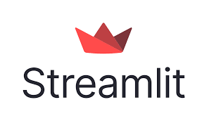
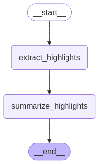

# PDF Summarizer with Streamlit, LangGraph, and Groq

## **Goal**

This application allows users to upload PDF documents, extract highlights, and generate summaries. The highlights are extracted using context from the document and then summarized them. Afterward, the summary is displayed and can be downloaded as a PDF.

The application leverages Groq’s LLM API for summarization and uses Streamlit to provide an interactive user interface.

---

### **Technologies Used**

 
 

### **LangGraph Structure**

Here’s a visual representation of the LangGraph workflow used for processing and summarizing the highlights:

## 

## **How It Works**

1. **User Uploads PDF**: The user uploads a PDF document via Streamlit's file uploader.
2. **Highlight Extraction**: The application scans the PDF, extracts any highlights, and gathers surrounding context.
3. **Summarization**: The extracted highlights and context are then processed and summarized using LangGraph with the help of Groq's LLM.
4. **Display & Download**: The summary is displayed in the Streamlit app, and users can download it as a PDF.

---

## **Installation and Setup**

### 1. **Clone the Repository**

First, clone this repository to your local machine:

```sh
git clone <repository_url>
cd <repository_directory>
```

### 2. **Install Required Packages**

Ensure you have all the dependencies installed:

```sh
pip install -r requirements.txt
```

```

### 3. **Get Your Groq API Key**

You will need a Groq API key to access their LLM. You can sign up for an account at [Groq](https://groq.com) and generate your API key.

### 4. **Create `.env` File**

In the root directory of the project, create a `.env` file to store your Groq API key. The `.env` file should contain the following:

```

GROQ_API_KEY=your_groq_api_key_here

````

Replace `your_groq_api_key_here` with the actual Groq API key you received.

### 5. **Run the Application**

After setting everything up, you can start the Streamlit app:

```sh
streamlit run streamlit.py
````

This will launch a local development server and open the application in your web browser.

### 6. **Using the App**

- Upload a PDF file using the file uploader.
- The app will process the file, extract highlights, summarize them, and display the summary on the page.
- You can download the generated summary as a PDF file.

---

## **Folder Structure**

```plaintext
├── .env              # Contains your Groq API key
├── streamlit.py      # Streamlit application
├── summarizing_highlights.py  # Script for highlight extraction and summarization
├── requirements.txt  # List of dependencies
└── README.md         # This file
```

---

## **Dependencies**

- **Streamlit**: For building the interactive web interface.
- **LangGraph**: Used to handle highlight extraction and summarization with Groq LLM.
- **Groq**: Provides the API for advanced language models (LLM) used for summarization.
- **PyMuPDF**: For text extraction from PDF files.
- **FPDF**: For generating downloadable PDF files with the summary.

---

## **Contributing**

Feel free to fork the repository and submit pull requests for any enhancements or bug fixes.
